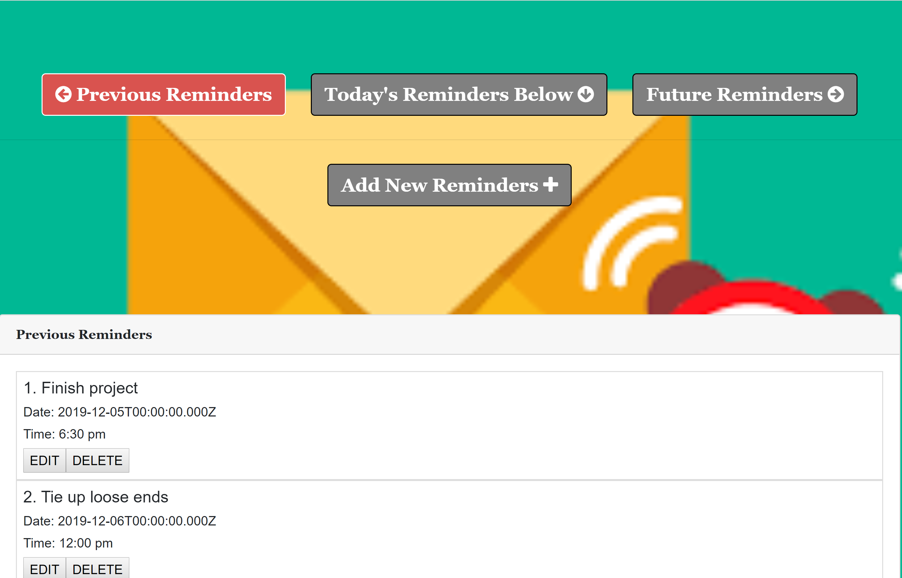

<h1>Reminders-Plus</h1>

>Reminders-Plus is a full stack web application using the MVC paradigm and our own server-side API.

>The goal of Reminders-Plus is simple.
To provide a shared view of tasks that must be done, using reminders with alerts. Helpful in a small office setting or collaborating on a project.


>With Reminders-Plus, you can simply take the tasks that have to be performed and share reminders amongst many users.


<hr>


<hr>


<h3> App demo </h3>

[Reminders-Plus](https://reminders-dave.herokuapp.com/)




<hr>

<h2> How it works </h2>
Start at the register page to enter unique user information.

- ```Register button will take you to Present page with today's reminders``` 

- ```Choosing Add New Reminders lets you enter a reminder with date, time and email address```
  
- ```Reminders can be chosen by email address allowing for individual or group reminder notifications```
  
- ```We used the Notification interface of the Notifications API to configure and display desktop notifications to the user```

<hr>

<h2>Technology and packages used</h2>

[Node.js](https://nodejs.org/en/)

[dotenv](https://www.npmjs.com/package/dotenv)

[express](https://www.npmjs.com/package/express)

[mysql](https://www.npmjs.com/package/mysql)

[mysql2](https://www.npmjs.com/package/mysql2)

[require](https://www.npmjs.com/package/require)

[sequelize](https://www.npmjs.com/package/sequelize)

[moment](https://www.npmjs.com/package/moment)

[uglify-js](https://www.npmjs.com/package/uglify-js)


<hr></hr>

<h4>Below is a thorough, but not comprehensive, step-by-step process of how I got the app running in terms of code</h4>

- Navigate to root of project. Initialize package.json by running ```npm init -y```

- Creation of .gitignore file

- Creation of server.js

- Creation of .env file to store database information

- Creation of Models folder to define UserInfo.js and reminder.js 

- Creation of Routes folder to store API and HTML routes

- Creation of views folder to store all the different html views


- ```npm install dotenv```

- ```npm install express```

- ```npm install mysql```

- ```npm install mysql2```

- ```npm install moment```

- ```npm install require```

- ```npm install sequelize``` 

- ```npm install uglify-js``` 

>We ran into a few issues along the way that kept us from fully realizing all the functions of our app. We had a hard time with the the table associations, but eventually got it working with help from our teacher. 

>We still need to streamline the reminders according to each user, and the edit(update) feature is still being worked on.


<h2>Authors:  David Levens * Curtis Charles * Jon-Luc Robbins</h2>